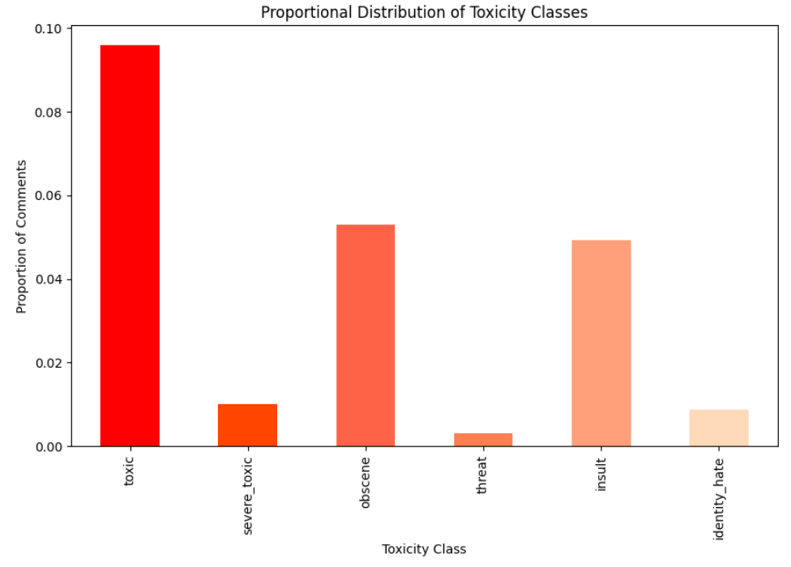
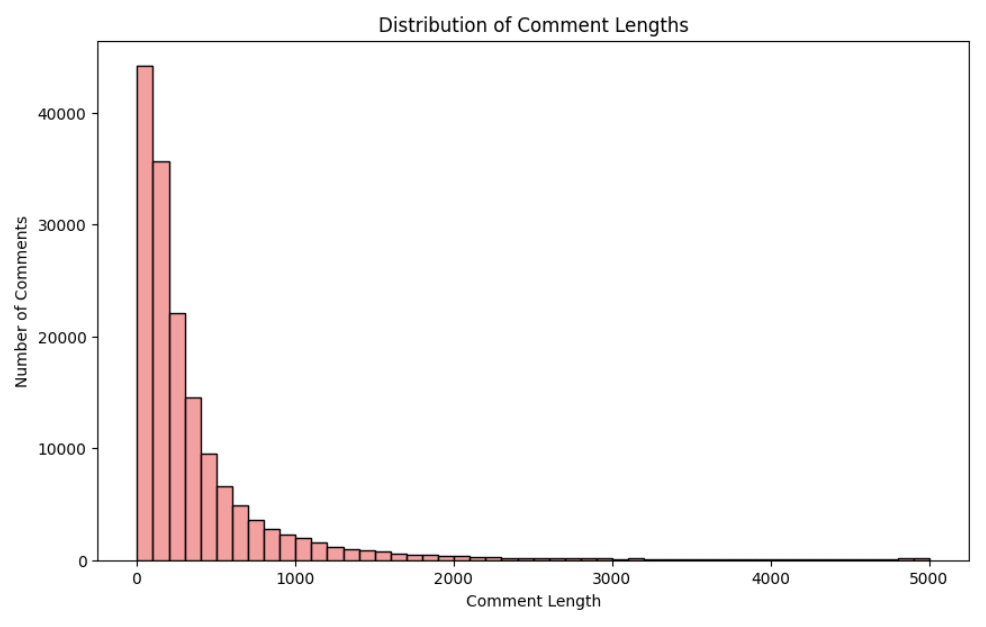
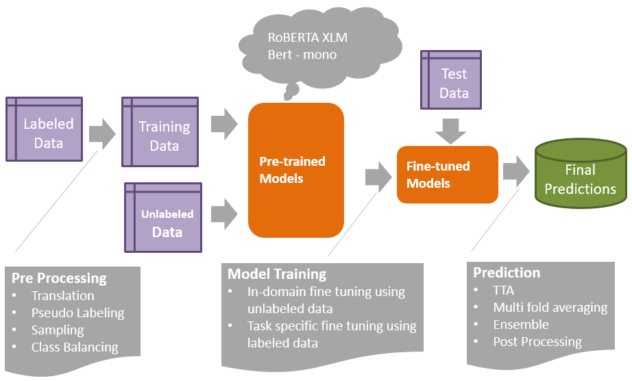
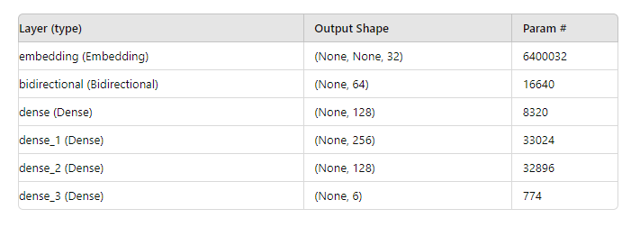
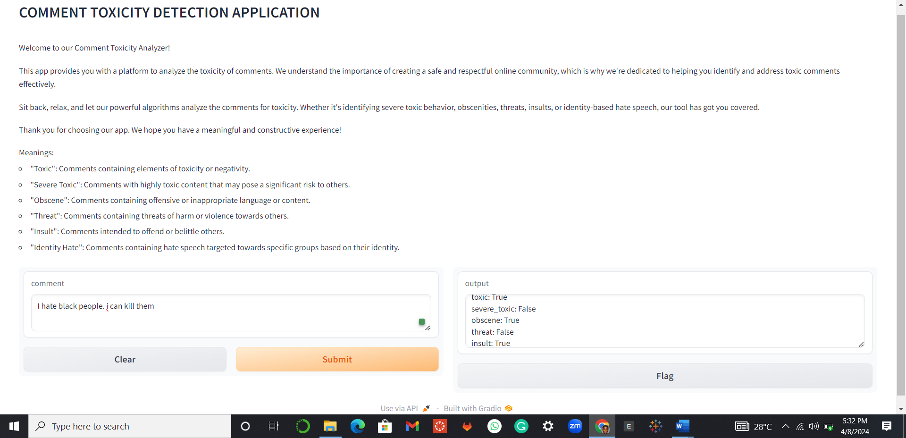

# Comment Toxicity Detection

 
***
## Background

Comments on online platforms play a crucial role in fostering discussions and building communities. However, the rise of toxic comments poses a significant challenge to maintaining healthy online environments. Toxic comments can include hate speech, insults, or any form of harmful language that can negatively impact users' experiences.
***
## Project Objective

The primary goal of this project is to develop a comment toxicity analysis model. The model aims to automatically identify and classify comments based on their level of toxicity. By doing so, we can:
- **Foster Healthy Discussions**: Encourage positive and constructive conversations within online communities.
- **Enhance User Experience**: Create a safer online environment by filtering out harmful content.
- **Support Moderation Efforts**: Assist content moderators in efficiently managing and maintaining a positive online space.
***
## Dataset Overview

We are working with a dataset containing a large number of Wikipedia comments, labeled by human raters for toxic behavior. The types of toxicity include:
- **toxic**
- **severe_toxic**
- **obscene**
- **threat**
- **insult**
- **identity_hate**

The dataset allows us to build a multi-headed model capable of predicting the probability of each type of toxicity for a given comment.
***
### Dataset Statistics

**Toxicity Columns:**
- **Mean**: Represents the proportion of comments exhibiting each type of toxicity. For example, the mean for 'toxic' is 0.0958, suggesting that approximately 9.58% of comments are toxic.
- **Standard Deviation (std)**: Measures the spread or variability in the data. Higher values indicate more variability.
***
**Comment Length:**
- **Mean**: The mean comment length is 394.07 characters.
- **Standard Deviation (std)**: The standard deviation for comment length is 590.72, indicating a wide range of comment lengths.
- **Min/Max**: The minimum comment length is 6 characters, and the maximum is 5000 characters.
- **Percentiles (25%, 50%, 75%)**: 25% of comments have a length of 96 characters or less, 50% have a length of 205 characters or less, and 75% have a length of 435 characters or less.

  
  
***
## Approach

Our approach involves using natural language processing (NLP) techniques and machine learning algorithms to analyze and classify comments. We will explore traditional machine learning models and neural network-based models to find the most effective solution for our specific use case.
***
## Steps

  

1. **Import Dependencies**: Load necessary libraries and packages.
2. **Explore the Dataset**: Gain insights into the data structure and characteristics.
3. **Prepare the Data**: Clean and preprocess the data for modeling.
4. **Preprocess**: Tokenize and transform the text data.
5. **Create Sequential Model using Keras**: Build and compile the neural network model.
6. **Make Predictions**: Use the model to predict the toxicity levels of comments.
7. **Evaluate the Model**: Assess the model's performance using appropriate metrics.
8. **Test and Implement the Gradio App**: Develop a user-friendly interface for the model using Gradio.
***
### Model Architecture

```python
model = Sequential()
# Creating the embedding layer
model.add(Embedding(Max_word+1, 32))
# Creating the Bidirectional LSTM Layer
model.add(Bidirectional(LSTM(32, activation='tanh')))
# Feature extractor Fully connected layers
model.add(Dense(128, activation='relu'))
model.add(Dense(256, activation='relu'))
model.add(Dense(128, activation='relu'))
# Final layer
model.add(Dense(6, activation='sigmoid'))
model.compile(loss='binary_crossentropy', optimizer='adam')
model.summary()
```
***

 

### Training History Visualization Clarification

The absence of a line in the training history plot may be attributed to the model being trained for only one epoch. In machine learning, an epoch represents one complete pass through the entire training dataset. With just a single epoch, there might not be enough iterations for the model to learn and exhibit significant changes in performance metrics. To observe meaningful trends and patterns, it is recommended to train the model for more epochs. Consider increasing the number of epochs in the model.fit function (e.g., epochs=10) before visualizing the training history. This will provide a clearer depiction of the model's learning process over multiple iterations.

```python
history = model.fit(train, epochs=1, validation_data=val)
```
***
## Installation

To run this project, clone the repository and install the required dependencies:

```bash
git clone https://github.com/your-username/comment-toxicity-detection.git
cd comment-toxicity-detection
pip install -r requirements.txt
```
***
 
